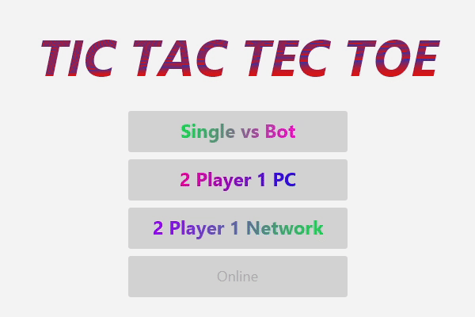

# TicTacTecToe
## Installation
**Download TicTacTecToe.jar** and start it by double-clicking on it. 
Link: https://github.com/DustinScharf/TicTacTecToe/releases/download/v1.2/TicTacTecToe.jar  
_(Requires Java 11 or newer)_
## How does the game work?
Select a game mode and the game will start.

1. **Selection Phase** 
Select a PLACER, the player sending the higher PLACER starts this round 
PLACERs are the numbers above / below the 3x3 board

2. **Place Phase** 
Select a PLACER, and place it on the board 
Placing is possible on an empty field or a field with a lower placer on it

3. **Win Check** 
If a player hits 3 PLACERS in a row (like normal TicTacToe) the players wins 
If a player can not set anything, the other player wins 
If none of them holds, the selection phase starts again

#### Note: Project for trying and learning
_The Project is used for trying and learning first JavaFX and first network programming stuff.  
The network traffic is minimal for hosting on a private computer,
but the network is not designed secure._
